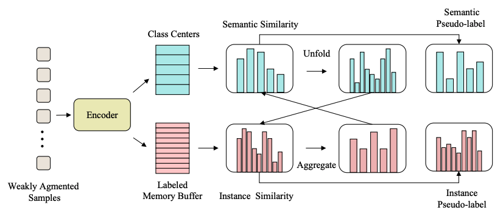

# SimMatch: Semi-supervised Learning with Similarity Matching (CVPR2022)

This repository contains PyTorch evaluation code, training code and pretrained models for SimMatch. Most of the code in this repository is adapt from [here](https://github.com/amazon-research/exponential-moving-average-normalization).

For details see [SimMatch: Semi-supervised Learning with Similarity Matching](https://arxiv.org/abs/2203.06915) by Mingkai Zheng, Shan You, Fei Wang, Chen Qian, and Chang Xu

## Reproducing
To run the code, you probably need to change the Dataset setting (ImagenetPercentV2 function in dataset/imagenet.py), and Pytorch DDP setting (dist_init function in util/dist_utils.py) for your server environment.

The distributed training of this code is based on slurm environment, we have provided the training scrips in script/train.sh

We also provide the pre-trained model. 

|          |Arch | Setting | Epochs  | Accuracy | Download  |
|----------|:----:|:---:|:---:|:---:|:---:|
|  SimMatch | ResNet50 | 1% | 400  | 67.2 % | [simmatch-1p.pth](https://drive.google.com/file/d/1N-i7QwAyUuc862jm_nZLCKJL2cJCvbbD/view?usp=sharing) |
|  SimMatch | ResNet50 | 10% | 400  | 74.4 % | [simmatch-10p.pth](https://drive.google.com/file/d/1Eeeqxixr9JtbrUmFDgRcf-tCWbPGnt2o/view?usp=sharing) |

If you want to test the pre-trained model, please download the weights from the link above, and move them to the checkpoints folder. The evaluation scripts also have been provided in script/train.sh
